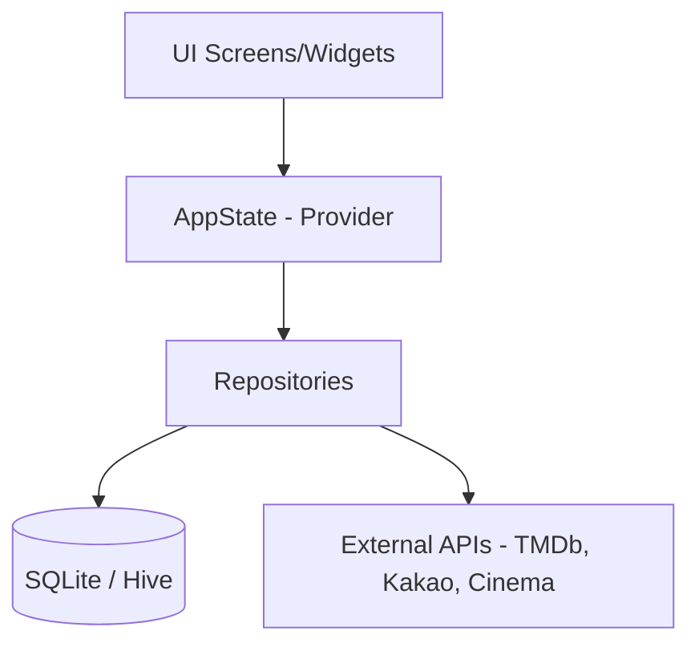

# 📚 무비어리 (Moviary)

나만의 영화 다이어리 서비스

---

## 1. 프로젝트 설명

### 📝 한 줄 소개
TMDb와 영화관 실시간 데이터를 결합하여 영화 탐색부터 관람 기록, 취향 분석까지 한 권의 다이어리에 담아내는 **감성 영화 기록 앱**입니다.

### ✨ 주요 특징
* **아날로그 감성 UI**: 종이 질감의 배경, 손글씨 느낌의 폰트(TypoCrayon), 다채로운 마스킹 테이프 데코레이션을 통해 실제 다이어리를 꾸미는 듯한 경험을 제공합니다.
* **실시간 상영 정보**: 카카오 로컬 API와 영화관 API를 연동하여 내 주변 영화관의 실시간 상영 시간표를 확인하고 예매까지 연결합니다.
* **데이터 기반 취향 분석**: 내가 남긴 기록을 분석하여 선호 장르, 관람 추이 그래프, 맞춤형 영화 추천 서비스를 제공합니다.

### 🛠 사용 기술
| 분류 | 기술 스택 |
| --- | --- |
| **Framework** | Flutter (Dart) |
| **State Management** | Provider |
| **Database** | SQLite (sqflite), Hive (NoSQL) |
| **API** | TMDb API, Kakao Local API, Lotte Cinema & Megabox API |
| **Local Data** | CSV Parsing (Lotte/Megabox Info) |
| **Utilities** | Geolocator (위치), URL Launcher (예매 연동), Image Picker |

---

## 2. 페이지별 기능

### 🔍 탐색 (Explore)
* TMDb 기반 실시간 영화 검색 및 목록 조회.
* 현재 상영 중인 영화에 'NEW' 배지 표시 및 상영관 정보 연결.
* 영화 상세 정보(포스터, 장르, 평점 등) 확인 및 위시리스트 추가.

### 📖 일기 (Diary)
* 3열 그리드 형태의 감성적인 관람 기록 카드.
* 재관람 기록 시 '재관람' 리본 데코레이션 자동 적용.
* 최신순, 평점순, 많이 본 순(그룹화) 등 다양한 정렬 및 기간 필터링.

### 💖 저장 (Saved)
* 보고 싶은 영화를 모아보는 위시리스트 공간.
* 귀여운 캐릭터와 말풍선 UI를 통한 직관적인 안내.

### 📊 취향 (Taste)
* **통계 카드**: 총 관람 수, 평균 별점, 최애 장르 분석.
* **관람 추이**: 월별/연도별 관람 횟수를 시각화한 라인 차트.
* **추천 서비스**: 사용자의 선호 장르와 평점을 분석하여 보지 않은 영화 추천.

### 🎬 상영관 (Theater)
* 현재 위치 기반 반경 5km 이내 영화관 검색.
* 롯데시네마, 메가박스 실시간 상영 시간표 및 잔여 좌석 정보 제공.
* 카카오맵 길찾기 및 영화관별 공식 예매 페이지 연동.

---

## 3. 시연 영상

| 탐색 및 영화 검색 | 관람 기록 작성 | 일기장 및 정렬 | 취향 분석 및 추천 |
| :---: | :---: | :---: | :---: |
| [빈 칸: 영상/이미지] | [빈 칸: 영상/이미지] | [빈 칸: 영상/이미지] | [빈 칸: 영상/이미지] |

> *추가 시연 영상 혹은 GIF를 이곳에 배치해 주세요.*

---

## 4. How to Install

아래 링크를 통해 최신 버전의 무비어리 설치 파일(APK)을 다운로드할 수 있습니다.

[📲 Moviary APK 다운로드 (Link 준비 중)]

---

## 5. 아키텍처 및 데이터 흐름

## 우리 팀!!
| 김예은 | 김태우 |
| :---: | :---:   |
|  |  |
| [@YeaeunnKim](https://github.com/YeaeunnKim) | [@twkim02](https://github.com/twkim02) |
| 고려대학교 통계학과 4학년 | 한양대학교 데이터사이언스전공 4학년 |

